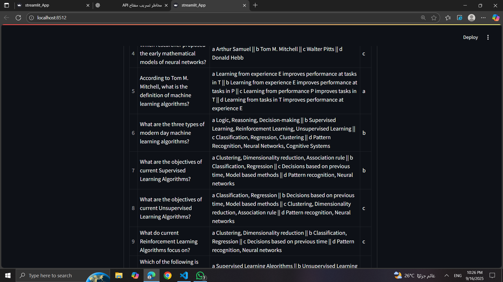

# 📝 Quiz Generator using LLM & LangChain

## 📌 Introduction
**Quiz Generator** is an interactive application that automatically generates multiple-choice questions (MCQs) from educational text.  
It leverages **Large Language Models (LLMs)** through **LangChain** to create and review quiz questions,  
and provides a simple interface using **Streamlit** for easy interaction.

---

## 🚀 Features
- 🧠 Automatically generate MCQs from any educational text.
- ✅ Ensure quality and correctness of questions and answers.
- 📊 Display questions and options in a **DataFrame** inside Streamlit.
- 📂 Support for **.txt** and **.pdf** files as input sources.
- ⚡️ Customizable (number of questions, subject, tone, difficulty).

## 📸 Screenshots

Here’s a preview of the Quiz Generator app:

## 🛠️ Requirements
- Python 3.10 or later
- Required libraries:
  - `langchain`
  - `streamlit`
  - `openai` (or any compatible API)
  - `pandas`
  - `PyPDF2`
  - `python-dotenv`

